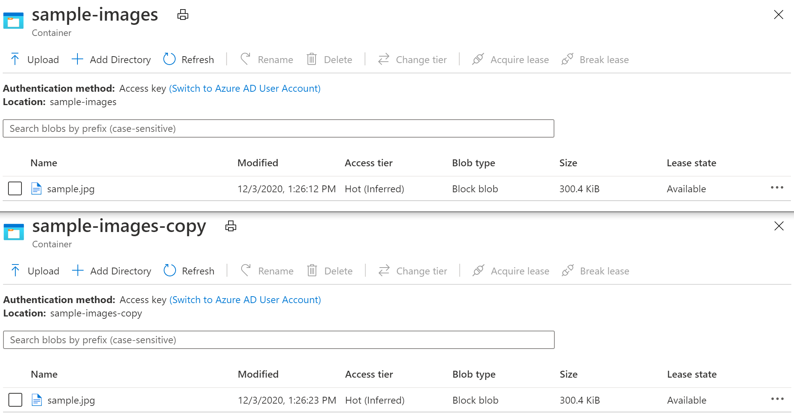

# pyfuncbloboutput
A python Azure Functions sample that uses a blob input trigger and a blob output binding to copy blobs between containers and maintain the content-type. Mostly inspired by https://github.com/MicrosoftDocs/azure-docs/blob/master/articles/azure-functions/functions-bindings-storage-blob-output.md and https://github.com/glennmusa/pyfuncblobclone.

